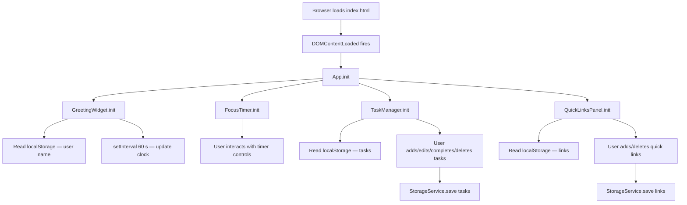
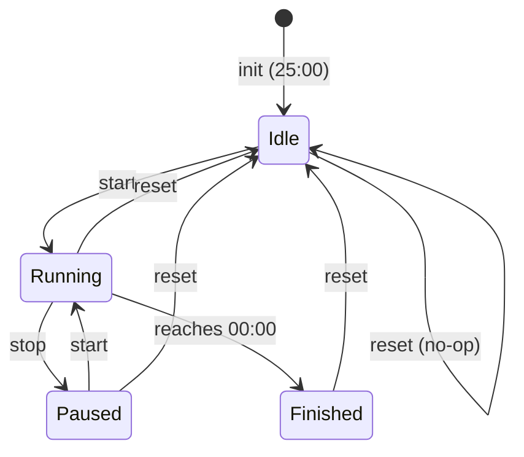

# Design Document

## Overview

The To-Do Life Dashboard is a client-side single-page application (SPA) built with plain HTML5, CSS3, and Vanilla JavaScript (ES2020+). It requires no build steps, no bundlers, no external libraries, and no backend. All persistence is handled via the browser's native `localStorage` API.

The application renders four self-contained widgets on a single HTML page (`index.html`):

| Widget | Responsibility |
|---|---|
| **Greeting_Widget** | Live clock, date, and time-of-day greeting |
| **Focus_Timer** | 25-minute Pomodoro countdown with start/stop/reset |
| **Task_Manager** | Full CRUD task list with localStorage persistence |
| **Quick_Links_Panel** | User-defined URL shortcuts with localStorage persistence |

All styling lives in `css/style.css` and all logic lives in `js/app.js`. The application targets the latest stable release of Chrome, Firefox, Edge, and Safari, and must load within 2 seconds on a 25 Mbps connection.

---

## Architecture

### File Structure

```
index.html          — single HTML page; declares markup for all four widgets
css/
  style.css         — all visual styling (layout, responsive, themes)
js/
  app.js            — all application logic (widget modules, storage, event handling)
```

### Module Organisation in `app.js`

Because no bundler is used, the entire JavaScript codebase lives in one file. The file is divided into clearly-commented logical sections using an IIFE (Immediately Invoked Function Expression) or a plain module pattern with `const` closures to avoid polluting the global scope.

```
app.js
├── Constants & Configuration
├── StorageService          — thin wrapper around localStorage
├── GreetingWidget          — clock/date/greeting logic
├── FocusTimer              — countdown timer state machine
├── TaskManager             — task CRUD, validation, rendering
├── QuickLinksPanel         — link CRUD, validation, rendering
└── App.init()              — bootstraps all widgets on DOMContentLoaded
```

### Interaction Flow



---

## Components and Interfaces

### StorageService

A centralised, error-safe wrapper around `localStorage`. Every read/write goes through this service so that widgets never need to handle `localStorage` exceptions directly.

```javascript
StorageService = {
  get(key)        // returns parsed JSON value or null on parse error / missing key
  set(key, value) // JSON-serialises value and writes; returns { ok: true } or { ok: false, error }
  remove(key)     // removes a key; returns { ok: true } or { ok: false, error }
  isAvailable()   // returns true if localStorage is accessible
}
```

**localStorage keys used:**

| Key | Type | Owner |
|---|---|---|
| `dashboard_user_name` | `string` | GreetingWidget |
| `dashboard_tasks` | `Task[]` (JSON array) | TaskManager |
| `dashboard_quick_links` | `QuickLink[]` (JSON array) | QuickLinksPanel |

---

### GreetingWidget

**Responsibilities:** display live HH:MM time, full date string, and a greeting that adapts to the hour of day.

**Initialisation sequence:**
1. Call `renderGreeting()` immediately.
2. Start a `setInterval` of 60,000 ms that calls `renderGreeting()` on each tick.

**Greeting logic:**

```
hour 0–11  → "Good Morning[, Name]"
hour 12–17 → "Good Afternoon[, Name]"
hour 18–23 → "Good Evening[, Name]"
```

**DOM targets** (IDs defined in `index.html`):

| ID | Content |
|---|---|
| `#greeting-time` | HH:MM |
| `#greeting-date` | e.g. "Monday, 16 June 2025" |
| `#greeting-message` | e.g. "Good Morning, Alex" |

---

### FocusTimer

**Responsibilities:** manage a 25-minute countdown with start, stop, and reset controls.

**State machine:**



**Internal state:**

```javascript
{
  remainingSeconds: 1500,  // 25 * 60
  state: 'idle',           // 'idle' | 'running' | 'paused' | 'finished'
  intervalId: null
}
```

**Button enable/disable rules:**

| Timer State | Start | Stop | Reset |
|---|---|---|---|
| idle | ✅ | ❌ | ✅ |
| running | ❌ | ✅ | ✅ |
| paused | ✅ | ❌ | ✅ |
| finished | ✅ | ❌ | ✅ |

**Session-end visual indicator:** a CSS class `timer--finished` is toggled on the timer container. It persists until reset is activated.

---

### TaskManager

**Responsibilities:** add, display, edit, complete/uncomplete, delete tasks; persist to localStorage via StorageService.

**Add-task flow:**
1. User submits input field.
2. Trim whitespace; reject if empty (show inline validation).
3. Reject if length > 200 characters (show inline validation).
4. Create Task object, prepend/append to in-memory array.
5. Call `StorageService.set('dashboard_tasks', tasks)`.
6. Re-render task list; clear input field.
7. If StorageService returns `{ ok: false }`, show inline storage error.

**Edit-task flow:**
1. User activates edit control → task row switches to edit mode (inline `<input>` pre-populated).
2. User confirms (Enter / save button):
   - Trim; reject if empty → inline error, retain original.
   - Reject if > 200 characters → inline error.
   - Update task in array, persist, re-render.
3. User cancels (Escape / cancel button) → discard changes, return to display mode.

**Task rendering:** each task renders as a `<li>` element with:
- Checkbox (completion toggle)
- Task description text (or edit input in edit mode)
- Edit button
- Delete button
- CSS class `task--completed` for completed tasks (applies `text-decoration: line-through`, `opacity: 0.5`)

**Validation message lifecycle:** inline messages are inserted as `<span>` siblings to the relevant input; they are removed when the user modifies the input value.

---

### QuickLinksPanel

**Responsibilities:** add, display, and delete user-defined URL shortcuts; persist to localStorage.

**Add-link validation:**
- Label: non-empty, max 50 characters.
- URL: non-empty, must start with `http://` or `https://`, must contain a valid domain (validated via `new URL(value)` catching any thrown `TypeError`).

**Maximum capacity:** 50 Quick_Links. When the list reaches 50, the submit control is `disabled` and a capacity message is shown. Removing a link re-enables the control.

**Rendering:** each Quick_Link renders as a `<div>` containing:
- A `<a>` anchor with `target="_blank"` and `rel="noopener noreferrer"` for the link button.
- A delete `<button>`.

**Delete-with-rollback:** if a `StorageService.set` call fails after a deletion, the item is restored to the in-memory array and re-rendered, and an inline error is displayed.

---

## Data Models

### Task

```javascript
{
  id: string,           // crypto.randomUUID() or Date.now().toString()
  description: string,  // 1–200 characters, trimmed
  completed: boolean,   // false = active, true = completed
  createdAt: string     // ISO 8601 timestamp
}
```

### QuickLink

```javascript
{
  id: string,    // crypto.randomUUID() or Date.now().toString()
  label: string, // 1–50 characters, trimmed
  url: string    // valid URL starting with http:// or https://, max 2048 chars
}
```

### localStorage Schema

All arrays are serialised as JSON. The stored values are always arrays (never `null`); an empty state is `[]`.

```
dashboard_user_name   → "Alex"
dashboard_tasks       → [{ id, description, completed, createdAt }, ...]
dashboard_quick_links → [{ id, label, url }, ...]
```

---

## Correctness Properties

*A property is a characteristic or behavior that should hold true across all valid executions of a system — essentially, a formal statement about what the system should do. Properties serve as the bridge between human-readable specifications and machine-verifiable correctness guarantees.*

### Property 1: Greeting hour-to-message mapping is exhaustive and correct

*For any* valid integer hour in [0, 23], the greeting function SHALL return exactly one greeting prefix — "Good Morning" for hours 0–11, "Good Afternoon" for hours 12–17, and "Good Evening" for hours 18–23 — with no hour producing an undefined or incorrect greeting.

**Validates: Requirements 1.3, 1.4, 1.5**

---

### Property 2: Greeting name suffix correctness

*For any* stored name value (including empty string, whitespace-only string, and absent key), the greeting message SHALL include the name suffix " , [Name]" if and only if the stored name is a non-empty, non-whitespace-only string.

**Validates: Requirements 1.6**

---

### Property 3: Non-empty task addition round-trip

*For any* valid task description (non-empty, ≤ 200 non-whitespace characters), after adding it through the Task_Manager, the task list serialised to localStorage SHALL contain an entry whose `description` equals the trimmed input, and deserialising that stored JSON SHALL produce a task list containing that entry.

**Validates: Requirements 3.2, 6.1, 6.5**

---

### Property 4: Whitespace-only and empty task descriptions are rejected

*For any* string composed entirely of whitespace characters (including the empty string), submitting it as a task description SHALL leave the task list unchanged (same length and same entries before and after the attempt).

**Validates: Requirements 3.3**

---

### Property 5: Task description length invariant

*For any* task description string exceeding 200 characters, submitting it SHALL leave the task list unchanged; and *for any* task successfully added, its stored `description` field SHALL be at most 200 characters.

**Validates: Requirements 3.6, 4.3**

---

### Property 6: Task completion toggle round-trip

*For any* task in any completion state, toggling the completion control twice SHALL return the task to its original completion state (idempotent double-toggle).

**Validates: Requirements 5.2, 5.3**

---

### Property 7: Task persistence serialisation round-trip

*For any* in-memory task list (with arbitrary tasks in any combination of completion states), serialising it via `JSON.stringify` and then deserialising via `JSON.parse` SHALL produce an array of task objects that are structurally identical to the originals (same `id`, `description`, `completed`, `createdAt`).

**Validates: Requirements 6.1, 6.2, 6.3, 6.4**

---

### Property 8: Quick link URL validation correctness

*For any* string, the URL validator SHALL accept it if and only if it begins with `http://` or `https://` AND `new URL(value)` does not throw — and SHALL reject all other strings, including empty strings and strings with other schemes.

**Validates: Requirements 7.2, 7.3**

---

### Property 9: Quick link persistence serialisation round-trip

*For any* in-memory Quick_Link list, serialising it via `JSON.stringify` and deserialising via `JSON.parse` SHALL produce an array of objects structurally identical to the originals (same `id`, `label`, `url`).

**Validates: Requirements 9.1, 9.2, 9.3**

---

### Property 10: Quick link capacity enforcement

*For any* Quick_Link list of length 50, attempting to add another Quick_Link SHALL leave the list length unchanged at 50.

**Validates: Requirements 7.6**

---

### Property 11: Timer state machine transition validity

*For any* sequence of valid user actions (start, stop, reset) applied to the Focus_Timer, the resulting timer state SHALL always be one of `{ idle, running, paused, finished }` and the `remainingSeconds` value SHALL always be in [0, 1500].

**Validates: Requirements 2.1, 2.2, 2.4, 2.5, 2.6, 2.7, 2.8, 2.9**

---

### Property 12: Deletion removes the targeted item

*For any* non-empty task list (or Quick_Link list) and any item `id` in that list, after calling the delete function for that `id`, the resulting list SHALL not contain any entry with that `id`, and all other entries SHALL remain unchanged.

**Validates: Requirements 5.5, 8.2**

---

## Error Handling

### localStorage Unavailability

At boot, `StorageService.isAvailable()` is called. If `localStorage` is inaccessible (e.g., private-browsing quota exhausted, security exception), a single global banner warning is shown at the top of the page. Each widget still renders in its default/empty state — the application degrades gracefully without crashing.

### localStorage Write Failures

All `StorageService.set` calls return `{ ok: boolean, error? }`. If `ok` is `false`, the calling widget:
- Does **not** crash.
- Retains the current in-memory state (the UI remains correct for the session).
- Shows a widget-local inline error message (e.g., "Could not save — storage error.").

### Malformed localStorage Data

`StorageService.get` wraps `JSON.parse` in a try/catch. If parsing fails, it returns `null`. Widgets treat `null` as an empty initial state (`[]` for arrays, `null` for the user name) and render accordingly. For Quick_Links, a visible error message is also displayed (Requirement 9.5).

### Task Edit Cancellation

The edit flow keeps a copy of the original `description` in a closure variable before entering edit mode. Pressing Escape or the cancel control restores the original without touching the array or localStorage.

### Input Validation Feedback

All inline validation messages are inserted adjacent to the relevant input field as `<span role="alert">` elements so screen readers announce them. They are removed by an `input` event listener on the field so they disappear as soon as the user starts correcting their input.

---

## Testing Strategy

### Dual Testing Approach

The project uses two complementary layers:

1. **Unit / example-based tests** — verify concrete behaviours, specific edge cases, and integration points between components.
2. **Property-based tests** — verify universal invariants by running each property 100+ times with randomised inputs.

Both are implemented as plain JavaScript test files, importable in Node.js, with no DOM dependency where possible (pure functions are extracted and tested in isolation; DOM-dependent logic is tested via a minimal jsdom setup or by running in a browser test harness such as Vitest with jsdom).

### Property-Based Testing Library

Use **[fast-check](https://github.com/dubzzz/fast-check)** (MIT licensed, zero production dependencies).

Each property test must run a minimum of **100 iterations**. Each test file includes a comment tag in the format:

```javascript
// Feature: todo-life-dashboard, Property N: <property text>
```

### Property Test Mapping

| Property | fast-check Arbitraries | What varies |
|---|---|---|
| P1 — Greeting hour mapping | `fc.integer({ min: 0, max: 23 })` | hour value |
| P2 — Greeting name suffix | `fc.option(fc.string())` | stored name (null / empty / whitespace / real) |
| P3 — Task add round-trip | `fc.string({ minLength: 1, maxLength: 200 }).filter(s => s.trim().length > 0)` | task description content |
| P4 — Whitespace rejection | `fc.stringOf(fc.constantFrom(' ', '\t', '\n'))` | whitespace string variants |
| P5 — Length invariant | `fc.string({ minLength: 201 })` | oversized descriptions |
| P6 — Completion toggle round-trip | `fc.boolean()` initial state | starting completion state |
| P7 — Task serialisation round-trip | `fc.array(fc.record({ id: fc.uuid(), description: ..., completed: fc.boolean(), createdAt: fc.string() }))` | arbitrary task arrays |
| P8 — URL validation | `fc.oneof(fc.webUrl(), fc.string())` | mix of valid and invalid URLs |
| P9 — QuickLink serialisation round-trip | `fc.array(fc.record({ id: fc.uuid(), label: ..., url: fc.webUrl() }))` | arbitrary link arrays |
| P10 — Capacity enforcement | `fc.array(validLinkArb, { minLength: 50, maxLength: 50 })` | full list |
| P11 — Timer state machine | `fc.array(fc.constantFrom('start','stop','reset'), { maxLength: 50 })` | action sequences |
| P12 — Deletion removes item | `fc.array(taskArb, { minLength: 1 })` + `fc.nat()` (pick index) | list size and which item to delete |

### Unit Test Coverage

| Area | What to test |
|---|---|
| GreetingWidget | Exact date string format ("Monday, 16 June 2025") |
| FocusTimer | Initial display is "25:00"; after tick, "24:59"; display at "00:00" |
| TaskManager | Edit cancels restore original; StorageService failure triggers error message |
| QuickLinksPanel | Link opens in new tab (`target="_blank"`); delete-rollback on storage failure |
| StorageService | `isAvailable` returns false when `localStorage` throws; `get` returns null on bad JSON |

### Integration Test

One end-to-end integration test (run in a browser or jsdom) loads `index.html`, exercises all four widgets in sequence, and verifies no uncaught errors are thrown to the console.

### Responsiveness

Manual + automated snapshot tests at 320px, 768px, 1280px, and 2560px viewport widths to verify no horizontal overflow and no widget overlap.
